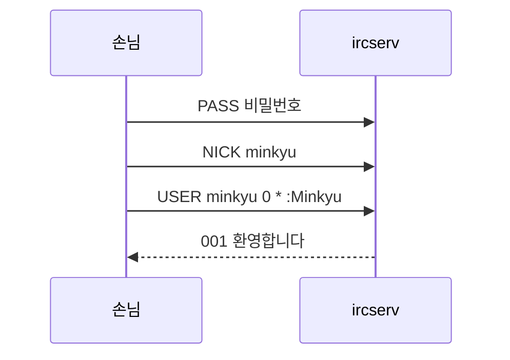

## 순서

```mermaid
sequenceDiagram
    participant C as 손님
    participant S as ircserv
    C->>S: PASS 비밀번호
    C->>S: NICK minkyu
    C->>S: USER minkyu 0 * :Minkyu
    S-->>C: 001 환영합니다
```

과제에서는 `PASS` 가 맞지 않으면 등록을 받지 않습니다. 세 명령이 모두 오기 전에는 다른 명령에 `451` 로 답합니다.
